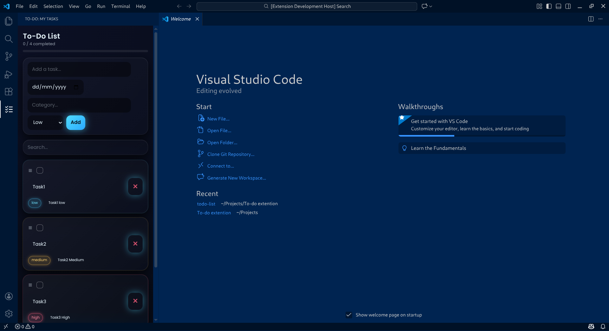

# 🚀 Neon Tasks - A Modern To-Do List for VS Code

A beautiful, glassmorphism-inspired **To-Do List extension for Visual Studio Code** with priorities, due dates, drag-and-drop reordering, and a clean neon UI.

Designed to be **fast**, **minimal**, and **pleasant to use** — right inside your editor.

---

## ✨ Features

* ✅ Add, edit, delete tasks
* 🎯 Priority levels: Low, Medium, High (color-coded)
* 📅 Due dates with overdue highlighting
* 🏷 Categories / tags
* 🔁 Drag & drop reordering
* 💾 Persistent storage
* 📊 Progress tracking
* 🔍 Search tasks
* 🌌 Glassmorphism + neon UI
* ⚡ Fast and lightweight
* 🎨 Modern dark theme friendly

---
## 📸 Screenshots
### **Screenshots of Extention**


---

## 📦 Installation (Local)

### 1. Clone the repo

```bash
git clone https://github.com/your-username/neon-tasks.git
cd neon-tasks
```

### 2. Install dependencies

```bash
npm install
```

### 3. Run in VS Code Extension Host

Press `F5` in VS Code.

---

## 🛠 Build the Extension

### Compile

```bash
npm run compile
```

### Package

```bash
vsce package
```

This will generate a `.vsix` file.

### Install locally

```bash
code --install-extension todo-list-0.0.1.vsix
```

---

## 🧠 Tech Stack

* TypeScript
* VS Code Webviews
* HTML / CSS
* Vanilla JavaScript
* Glassmorphism UI
* CSP-safe architecture

---

## 📂 Project Structure

```
.
├── src/
│   └── todoViewProvider.ts
├── media/
│   ├── styles.css
│   └── script.js
├── package.json
├── README.md
```

---

## 🤝 Contributing

Contributions are welcome!

You can help by:

* 🐛 Fixing bugs
* 🎨 Improving UI
* ⚡ Optimizing performance
* 🧩 Adding features
* 📖 Improving docs

### How to contribute

1. Fork this repo
2. Create a branch
3. Make your changes
4. Open a Pull Request

---

## 🗺 Roadmap

Planned features:

* ⏰ Reminders / notifications
* 📁 Task groups
* 📤 Export tasks
* ☁️ Cloud sync
* 🎨 Theme switching
* ⌨️ Keyboard shortcuts

---

## 🔐 Privacy

All data is stored **locally** inside VS Code.
No tracking. No telemetry. No network calls.

---

## 📜 License

MIT License — free to use, modify, and distribute.

---

## 💙 Author

Created by **Karthikeyan**
If you like this project, give it a ⭐ on GitHub!

---

## 🚀 Want to Publish on Marketplace?

If you want to release this officially on the VS Code Marketplace, I can help you with:

* Extension listing
* Screenshots
* Store description
* Tags
* SEO
* Publishing

Just tell me 😎
